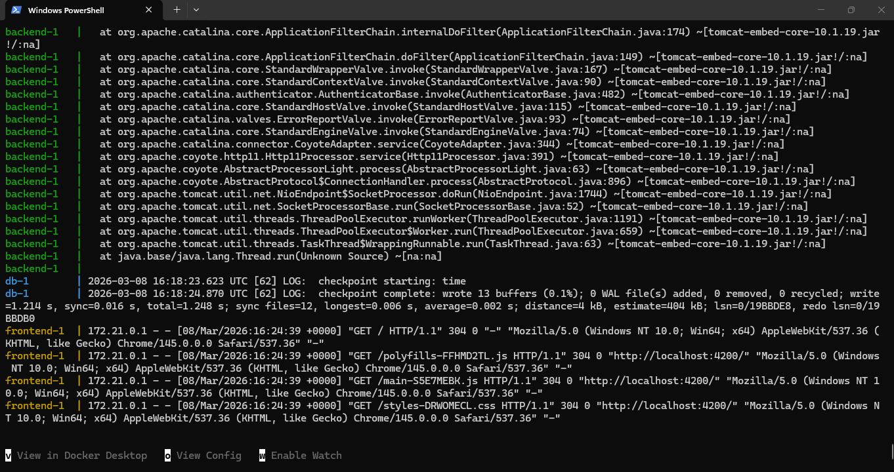
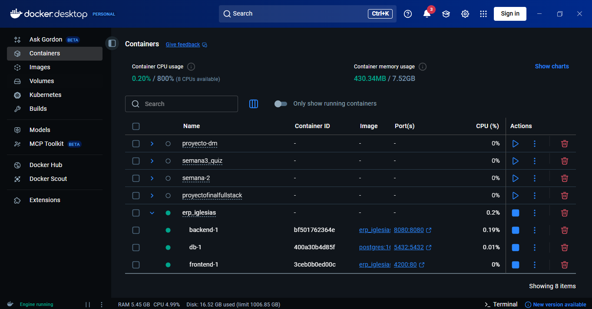
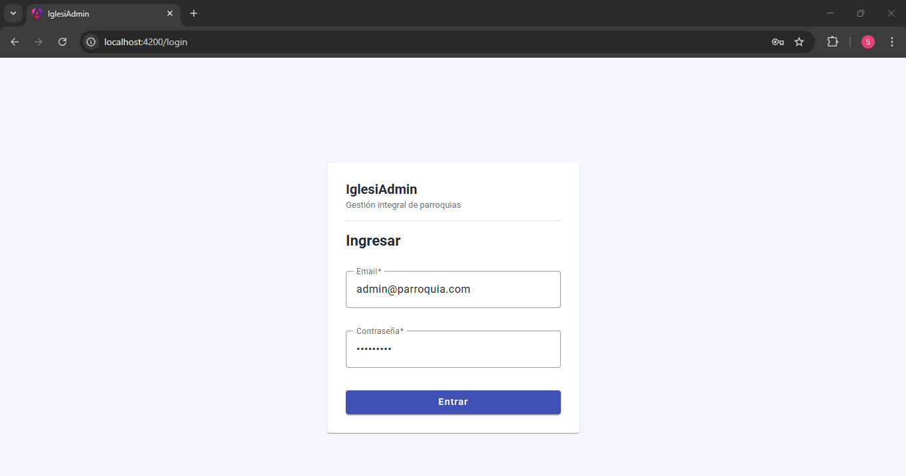

## Clonar y montar el proyecto localmente
Cada equipo debe clonar el repositorio, configurar el entorno de desarrollo y levantar la aplicación completa en su máquina local. Verifiquen que todas las funcionalidades del ERP están operativas.

se levanta y corre OK!

