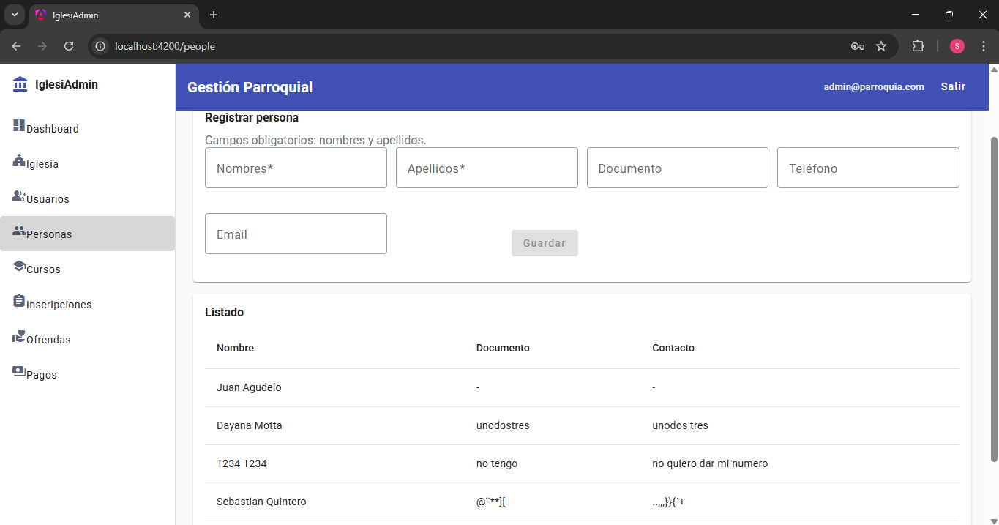
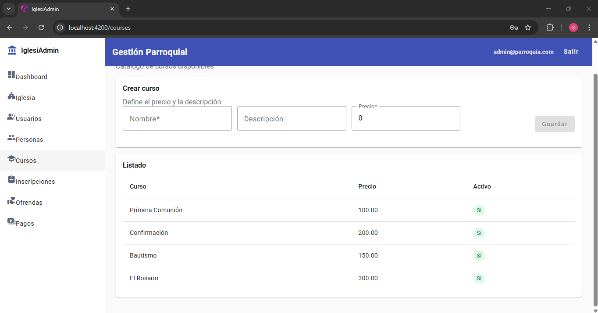
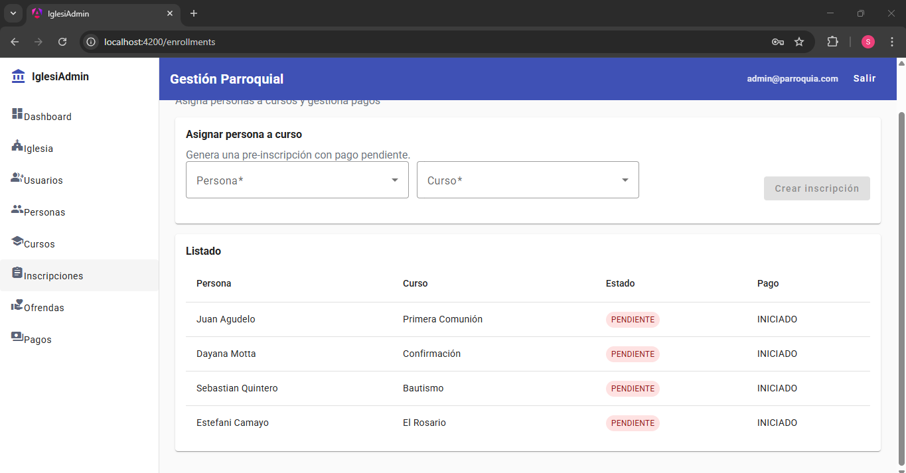
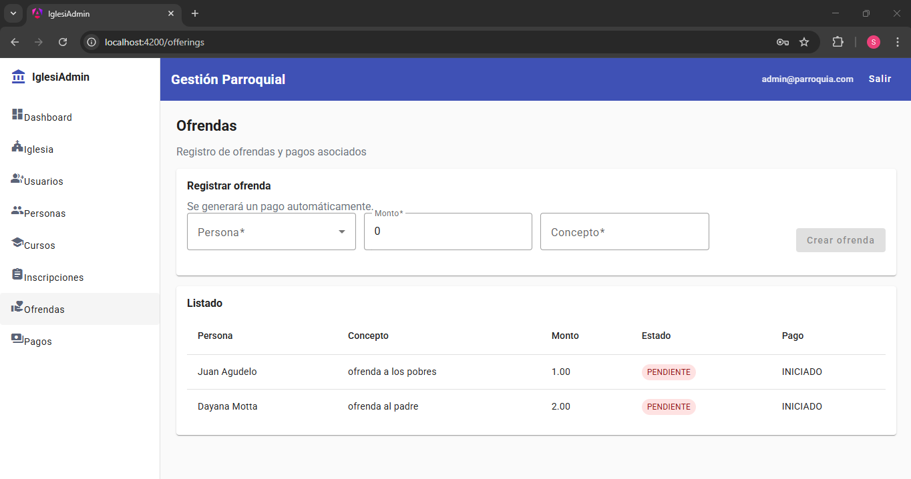
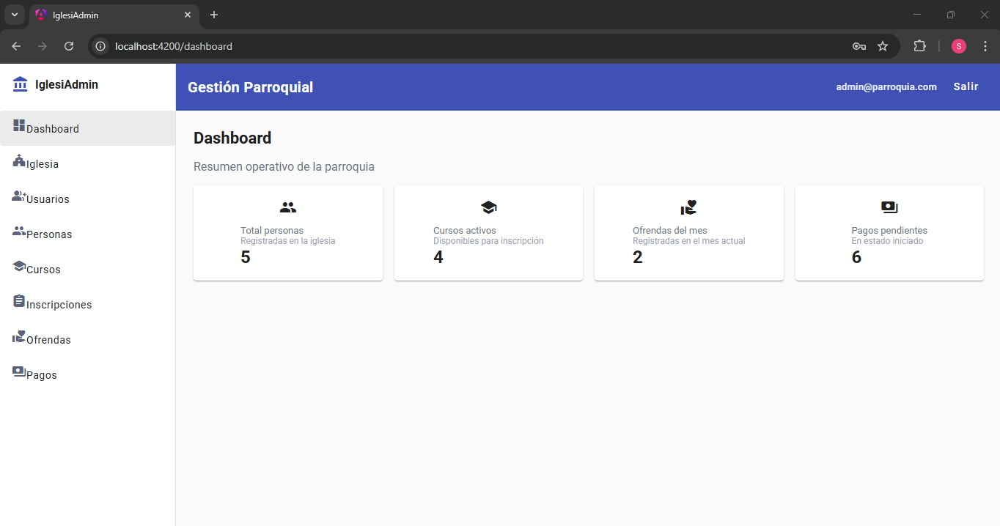

# Cambio 1: Service Layer Pattern

## Archivos Modificados/Creados

### Nuevos:
- `backend/src/main/java/com/iglesia/service/PersonService.java`
- `backend/src/main/java/com/iglesia/dto/request/PersonRequest.java`
- `backend/src/main/java/com/iglesia/dto/response/PersonResponse.java`

### Modificados:
- `backend/src/main/java/com/iglesia/PersonController.java`
- `backend/src/main/java/com/iglesia/PersonRepository.java`

## Descripción del Cambio
Se aplicó el patrón Service Layer para separar la lógica de negocio del controlador. Antes, `PersonController` manejaba todo: validaciones, acceso a datos y lógica de negocio.

## Antes y Después

### ANTES (PersonController.java):
```java
@PostMapping
public PersonResponse create(@RequestBody PersonRequest request) {
    // Lógica de negocio EN el controller ❌
    Church church = churchRepository.findAll().stream().findFirst()
        .orElseThrow(() -> new RuntimeException("No hay iglesia"));
    
    Person person = new Person();
    person.setFirstName(request.firstName());
    person.setLastName(request.lastName());
    person.setDocument(request.document());
    person.setPhone(request.phone());
    person.setEmail(request.email());
    person.setChurch(church);
    
    personRepository.save(person);
    return PersonResponse.from(person);
}
```

### DESPUÉS (PersonService.java):
```java
@Service
public class PersonService {
    @Transactional
    public PersonResponse createPerson(PersonRequest request) {
        // Lógica de negocio en Service ✅
        validateUniqueDocument(request.document());
        validateUniqueEmail(request.email());
        
        Church church = getCurrentChurch();
        Person person = mapToEntity(request, church);
        Person savedPerson = personRepository.save(person);
        
        return PersonResponse.from(savedPerson);
    }
}
```

### DESPUÉS (PersonController.java - limpio):
```java
@PostMapping
public PersonResponse create(@Valid @RequestBody PersonRequest request) {
    return personService.createPerson(request); // Solo llama al service ✅
}
```
### Pruebas

Para validar que el cambio no afectó el funcionamiento del sistema, se realizaron las siguientes pruebas.

## Prueba 1 — Crear persona




---

## Prueba 2 — Crear curso


---

## Prueba 3 — Crear inscripción



---

## Prueba 4 — Registrar ofrenda



---

## Prueba 5 — Visualizar dashboard

El dashboard muestra correctamente los datos del sistema



---
