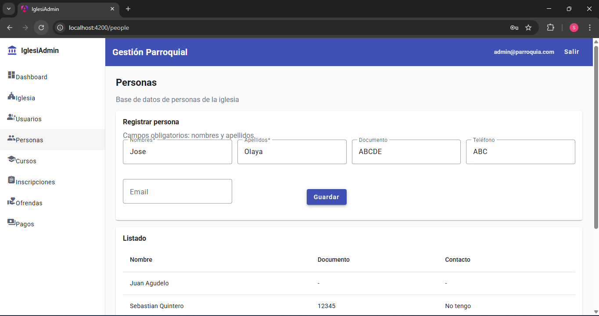
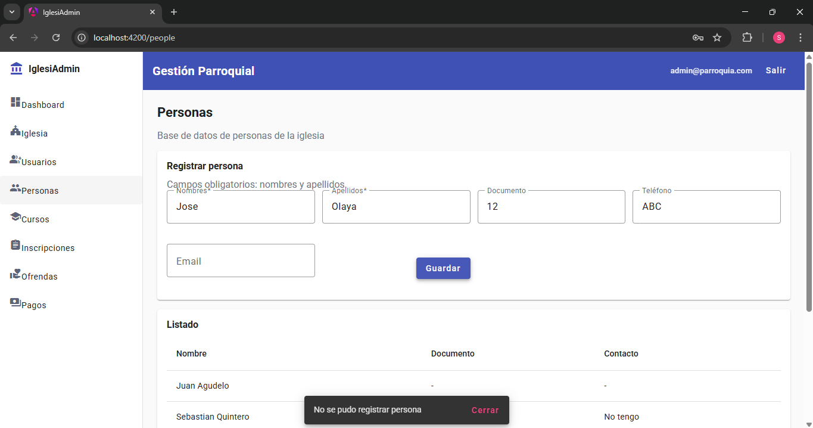
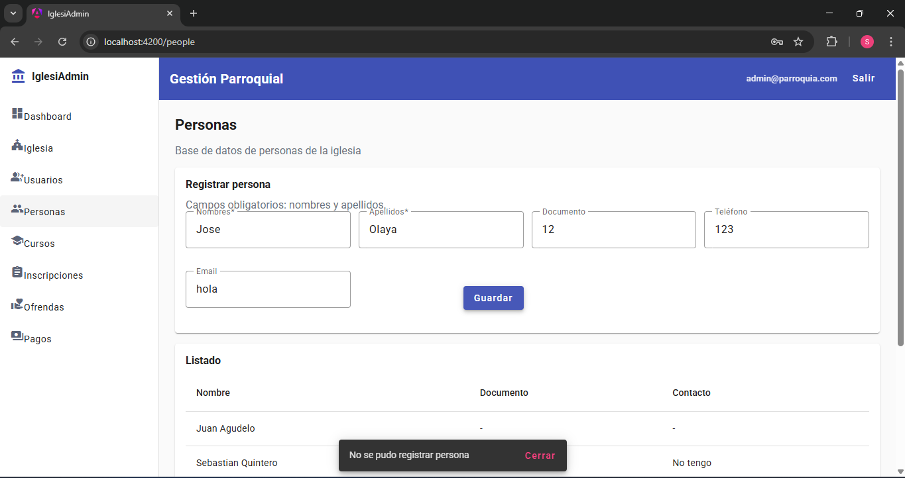
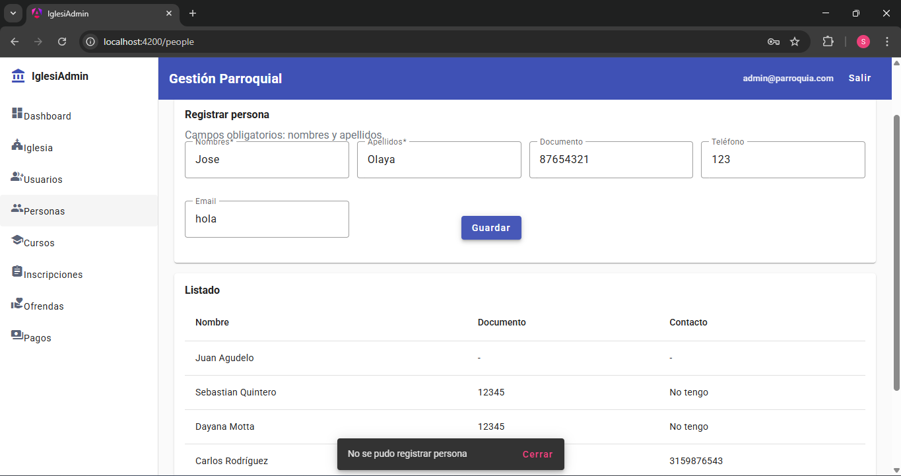
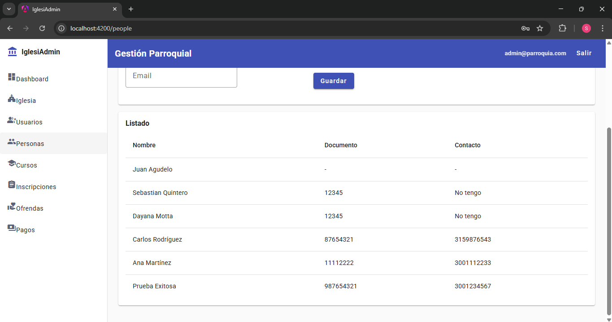

# Cambio 2: Strategy Pattern para Validaciones

## Archivos Modificados/Creados

### Nuevos:
- `backend/src/main/java/com/iglesia/validation/Validator.java`
- `backend/src/main/java/com/iglesia/validation/ValidationException.java`
- `backend/src/main/java/com/iglesia/validation/DocumentValidator.java`
- `backend/src/main/java/com/iglesia/validation/PhoneValidator.java`
- `backend/src/main/java/com/iglesia/validation/EmailValidator.java`
- `backend/src/main/java/com/iglesia/validation/CompositeValidationException.java`
- `backend/src/main/java/com/iglesia/validation/ValidationService.java`

### Modificados:
- `backend/src/main/java/com/iglesia/service/PersonService.java`

## Descripción del Cambio
Se implementó el patrón Strategy para encapsular las validaciones. Cada tipo de validación (documento, teléfono, email) es una estrategia independiente que implementa una interfaz común. Esto soluciona los hallazgos de la exploración donde se permitían datos inválidos.

## 🔍 Hallazgos que Soluciona

| Hallazgo | Ejemplo | Solución |
|----------|---------|----------|
| Documentos con letras | "ABC123" | ❌ → ✅ Solo números |
| Teléfonos con texto | "No tengo" | ❌ → ✅ Formato numérico |
| Emails sin @ | "correo-invalido" | ❌ → ✅ Formato nombre@dominio.com |
| Documentos duplicados | Dos personas mismo documento | ❌ → ✅ Validación de unicidad |
| Campos vacíos | document: "" | ❌ → ✅ Validación de requeridos |

## Código - Interfaz Validator (Strategy)

```java
public interface Validator<T> {
    void validate(T value) throws ValidationException;
    String getFieldName();
}

```
##  Código - DocumentValidator (Estrategia concreta)
```java
public class DocumentValidator implements Validator<String> {
    private static final Pattern DIGITS_ONLY = Pattern.compile("^\\d+$");
    
    @Override
    public void validate(String value) throws ValidationException {
        if (!DIGITS_ONLY.matcher(value).matches()) {
            throw new ValidationException("document", value, 
                "El documento debe contener solo números");
        }
        if (value.length() < 5) {
            throw new ValidationException("document", value, 
                "El documento debe tener al menos 5 dígitos");
        }
    }
}
```

## Código - ValidationService (Orquestador)
```java
@Service
public class ValidationService {
    public void validatePerson(PersonRequest request) {
        List<ValidationException> errors = new ArrayList<>();
        
        Validator<String> documentValidator = new DocumentValidator(true);
        Validator<String> phoneValidator = new PhoneValidator(true);
        Validator<String> emailValidator = new EmailValidator(true);
        
        // Ejecutar validaciones y capturar errores
        try {
            documentValidator.validate(request.document());
        } catch (ValidationException e) {
            errors.add(e);
        }
        // ... similar para phone y email
        
        if (!errors.isEmpty()) {
            throw new CompositeValidationException(errors);
        }
    }
}
```
## Integración con PersonService
``` java
@Service
public class PersonService {
    private final ValidationService validationService;
    
    public PersonResponse createPerson(PersonRequest request) {
        // 1. Validar formato con Strategy Pattern
        validationService.validatePerson(request);
        
        // 2. Validar unicidad
        validateUniqueDocument(request.document());
        validateUniqueEmail(request.email());
        
        // 3. Crear persona
        // ...
    }
}
```
# Pruebas

1. No deja crear documento con letras


2. El telefono no puede ser letras


3. El correo no puede ser solo palabras debe contener el @


4. Ya no permite guardar documento duplicado


5. Permite seguir creando exitosamente
