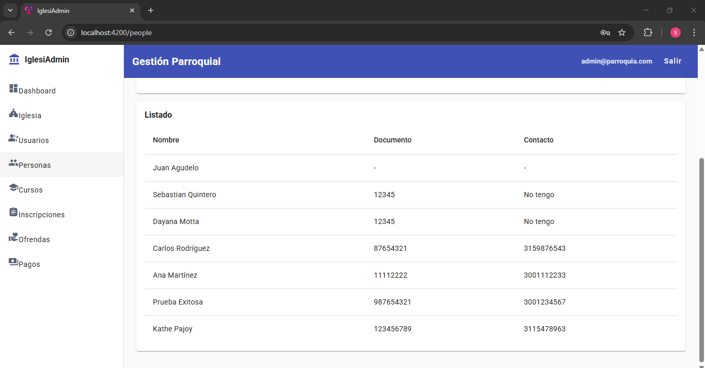

# Cambio 3: Patrón DTO (Data Transfer Object) - Completado

## Archivos Modificados
- `backend/src/main/java/com/iglesia/PersonController.java`

## Archivos Existentes (del Cambio 1)
- `backend/src/main/java/com/iglesia/dto/request/PersonRequest.java`
- `backend/src/main/java/com/iglesia/dto/response/PersonResponse.java`

## Descripción del Cambio
Se completó la implementación del patrón DTO eliminando los records internos de `PersonController` y utilizando los DTOs desde los paquetes dedicados creados en el Cambio 1.

## Antes y Después

### ANTES (PersonController.java):
```java
public class PersonController {
    // DTOs dentro del controller ❌
    public record PersonRequest(String firstName, String lastName) {}
    public record PersonResponse(Long id, String firstName) {}
    
    @PostMapping
    public PersonResponse create(@RequestBody PersonRequest request) {
        // ...
    }
}
```

### DESPUÉS (PersonController.java):
```java
public class PersonController {
    @PostMapping
    public PersonResponse create(@Valid @RequestBody PersonRequest request) {
        return personService.createPerson(request);  // Usa DTOs importados ✅
    }
}
```
### Pruebas Realizadas

1. Crear personas sigue funcional con la validación de los datos se cumpla la condicion:



